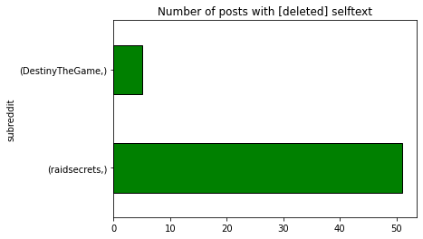
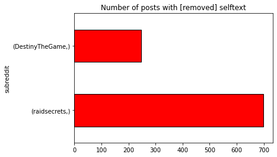
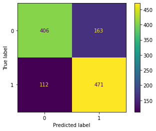
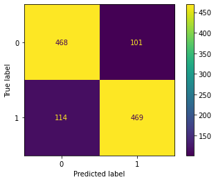
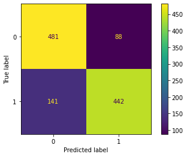

# Project 3 - Who Said It?  DestinyTheGame vs. RaidSecrets

*By Daniel Preston McBride*

---

## Background

> I am not a huge reddit user.  If I am on reddit, then I'm usually spending the majority of my time on two specific subreddits for my favorite online game, Destiny 2.

The DestinyTheGame subreddit is the "official" subreddit for the game, Destiny 2, as many of the actual developers and community managers will frequent the page to communicate with players.  Members will share their own in-game fun experiences, memes and jokes, and fan fiction as well as their frustrations with the game and feedback/ideas for the developers.  The subreddit boasts roughly 2 million members.

The Raidsecrets subreddit is used by Destiny community members more as a "strategy guide" to assist other players unlock many of the game's puzzles and hidden content.  Destiny 2 is a game built on player discovery and experimentation, so many community members decided to come together and combine their brain power to solve the most intricate riddles.  The subreddit has roughly 260 thousand members.

---

## Problem Statement

Today we will be utilizing natural language processing and the pushshift API to see if we can predict if a reddit post originated from the DestinyTheGame or Raidsecrets subreddits based on the language used in each post's selftext.  We will hopefully gain insight into where particular types of post content related to Destiny 2 resides and where they are acceptable for future knowledge of where to go for a particular community experience.

---

## Contents:

- [The Data](#The-Data)
- [Jupyter Lab Notebook Files](#Jupyter-Lab-Notebook-Files)
- [Exploratory Data Analysis](#Exploratory-Data-Analysis)
- [Predictive Modeling](#Predictive-Modeling)
- [Conclusion](#Conclusion)

---

## The Data

> `dest_reddit.csv` - Data scraped from DestinyTheGame subreddit of 2000 posts.
  
> `raid_reddit.csv` - Data scraped from Raidsecrets subreddit of 2000 posts.
  
> `reddit_data.csv` - Combined scraped data from both subreddits with cleaning for modeling utilization.
  

---

## Jupyter Lab Notebook Files

[Data scraping DestinyTheGame subreddit](./code/nlp_project_scraping_dest_reddit.ipynb)
 
[Data scraping Raidsecrets subreddit](./code/nlp_project_scraping_raid_reddit.ipynb)
 
 
[Data cleaning and EDA](./code/nlp_project_cleaning_eda.ipynb)
 
 
[Creating NLP Classification model with CountVectorizer Transformer and Multinomial Naive Bayes estimator](./code/nlp_project_model_cvec_nb.ipynb)
 
[Creating NLP Classification model with CountVectorizer Transformer and Random Forest estimator](./code/nlp_project_model_cvec_rf.ipynb)
 
[Creating NLP Classification model with TfidfVectorizer Transformer and Multinomial Naive Bayes estimator](./code/nlp_project_model_tvec_nb.ipynb)
 
[Creating NLP Classification model with TfidfVectorizer Transformer and k Nearest Neighbors estimator](./code/nlp_project_model_tvec_knn.ipynb)
 

---

## Exploratory Data Analysis

There was a total of 2000 scraped posts from each subreddit for a total of 4000 posts using pushshift api.  After dropping rows with null values in the predictor corpus of 'selftext' and checking for duplicate rows, a new column was created for the sole purpose of converting the utc timestamp into a readable datetime format to get a readable time frame of when each post was made.  All the 2000 posts scraped from DestinyTheGame were originally posted within a few days of each other while the Raidsecrets data had a few months between posts.  This highlighted the frequency of postings between the subreddits within the same number of posts.

# 

Some of the data simply had [removed] or [deleted] listed in the 'selftext' column instead of an actual post.  After a bit of exploration, it was discovered that [deleted] meant the post was removed by the actual user while [removed] meant the post was removed by a subreddit moderator.  While the number of [deleted] posts between both subreddits were relatively small, there was a greater number of [removed] posts between both subreddits, with a much larger portion of [removed] posts from the Raidsecrets subreddit.  The inclusion of the [removed] posts in the models could help determine the moderation level difference between the two subreddits.  Dropping the rows with [removed] selftext also ran the risk of skewing the distribution of data between both subreddits.

# 

---

## Predictive Modeling

The four models created utilized CountVectorizer and TfidfVectorizer as transformers and RandomForestClassifier, Multinomial Naive Bayes, and k Nearest Neighbors estimators.

# 

CountVectorizer/RandomForestClassifier Model

> This model, while not being too overfit, had the lowest accuracy score of 77.2% for predicting which subreddit a post belonged to against the test data.  The confusion matrix shows 112 false negatives and 163 false positives.

# 

TfidfVectorizer/MultinomialNB Model

> This model was slightly more overfit than the previous model while still not being too overfit.  There was a higher accuracy score of 81.7% against the test data.  The confusion matrix shows 114 false negatives and a lower number of false positives at 101.

# 

CountVectorizer/MultinomialNB Model

> The amount of overfitting was once again reduced with this model, and it also had a higher accuracy score of 81.4% on the test data in comparison to the first model.  The confusion matrix shows a slightly higher number of false negatives at 141 but a much lower number of false positives at only 88.

---

## Conclusion

In conclusion, all of the models predicted with roughly 77% to 81% accuracy of whether a post belongs to or should be posted on DestinyTheGame or Raidsecrets.  The model utilizing CountVectorizer and Multinomial Naive Bayes seems to be the best estimator of making new predictions.  This can help determine which subreddit is the proper place to post a specific subject type to increase exposure and to prevent being removed by moderation.

In the future, the models could possibly be refined even more by running a larger sample size through the them and possibly dropping rows with only links to images and videos.  A deeper analysis into the most common words and phrases that had the biggest impact on predictions could also help identify the type of content appropriate for each subreddit as well.
